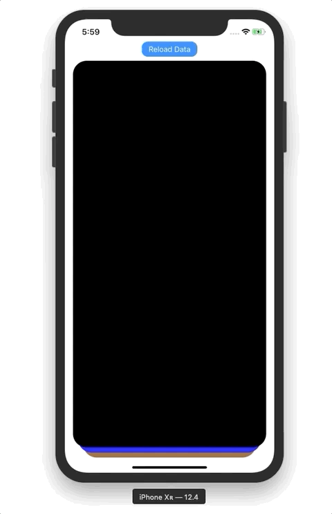
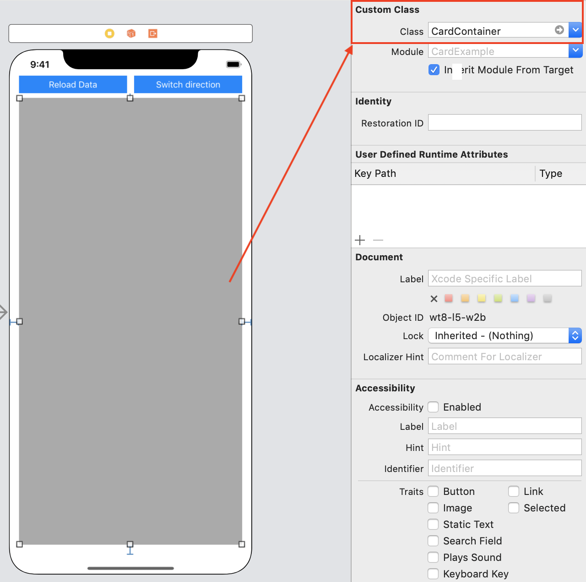

# CardContainer

**If you like CardContainer, give it a ⭐**


## Overview

CardContainer is a simple Tinder-like card cosntainer with `UITableView`-like API.

|                  Vertical swiping                  |                   HorizontalSwiping                   |
| :------------------------------------------------: | :---------------------------------------------------: |
|  |  |


## Installation

### Manual installation

Put all files from `CardExample/CardContainer` folder into your project


### Carthage

*Soon...*


## Usage

1. Place a `view`  and change its class to `CardContainer`

   

2. Implement `CardContainerDataSource` in your Controller (check the example project).

3. Make your Controller a delegate of `CardContainer` view (check the example project).

## Customisation

### SwipeableView

```swift
// Vertical threshold for swiping a view (in percents of view's height)
var verticalThreshold: CGFloat

// Horizontal threshold for swiping a view (in percents of view's width)
var horizontalThreshold: CGFloat
```

### CardContainer

```swift
// Number of cards visible in a container
var cardsToBeVisible: Int

// Horizontal inset of a card in a container
var horizontalInset: CGFloat

// Vertical inset of a card in a container
var verticalInset: CGFloat
```

### CardContainerDatasource

```swift
// This method in your Controller defines the swipe direcion: .horizontal or .vertical
func swipeType() -> SwipeType
```

### Providing custom views

To provide your own cards to `CardContainer` you have to subclass `SwipeableView` .

*e.g. [Creating a Custom View From a XIB](https://medium.com/better-programming/swift-3-creating-a-custom-view-from-a-xib-ecdfe5b3a960)*


## License

CardContainer is available under the MIT license.