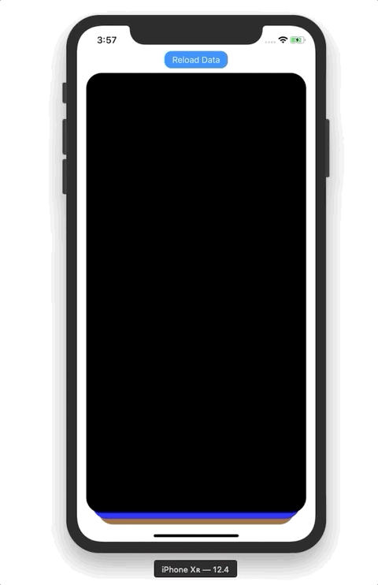

# CardContainer

**If you like CardContainer, give it a ⭐**

## Overview

CardContainer is simple Tinder-like card container with `UITableView`-like API.



## Installation

### Manual installation

Put all files from `CardContainer` folder into your project

### Carthage

Soon...


## Usage

1. Place a `view`  and change its class to `CardContainer`
3. Implement `CardContainerDataSource` in your Controller
4. Make your Controller a delegate of `CardContainer` view.

### Customisation

#### SwipeableView

```swift
// Vertical threshold for swiping a view (in percents of view's height)
var verticalThreshold: CGFloat

// Horizontal threshold for swiping a view (in percents of view's width)
var horizontalThreshold: CGFloat
```

#### CardContainer

```swift
// Number of cards visible in a container
var cardsToBeVisible: Int

// Horizontal inset of a card in a container
var horizontalInset: CGFloat

// Vertical inset of a card in a container
var verticalInset: CGFloat
```


## Providing custom views

To provide your own cards to `CardContainer` you have to subclass `SwipeableView` .

